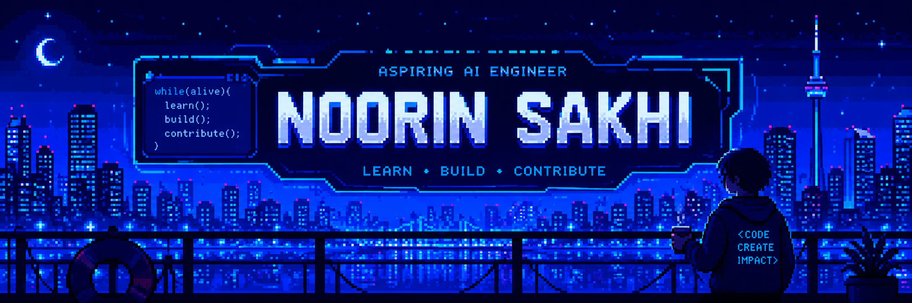

###### Join my org [Here ✉️](https://github.com/App-Choreography/Get-An-Invite/issues/new?assignees=CodingSpecies&labels=Organisation+Invite%21+%F0%9F%93%A8&template=please-can-i-join-this-organisation------.md&title=Please+Can+I+Join+This+Organisation%3F+%F0%9F%A5%BA%F0%9F%99%8F")

<div align="center">



```js
const noorin = {
    currentVersion: "v17.0",
    role: "Aspiring AI Engineer",
    location: "Toronto, Canada",
    status: "Building. Learning. Contributing."
};
```


</div>

---

<div align="center">

> *"The most dangerous phrase in the language is: We've always done it this way."*
>
> **- Grace Hopper**

</div>

---

# > booting noorin.exe

```bash
Initializing profile...

Loading Open Source...
Loading Artificial Intelligence...
Loading Cybersecurity...
Loading Collaboration...

Status: READY
```

---

## `aboutMe.js`

```javascript
const noorin = {
    name: "Noorin Sakhi",
    role: "Aspiring AI Engineer",
    education: "Grade 12 Student",
    location: "Toronto, Canada",

    interests: [
        "Software engineering",
        "Artificial Intelligence",
        "Cybersecurity",
        "Front-end",
        "Open Source",
        "Collaboration"
    ],

    passionateAbout: [
        "Creating impactful applications",
        "Building with purpose",
        "Global collaboration",
        "Open source communities"
    ],

    currentlyLearning: [
        "TypeScript",
        "Python",
        "Artificial Intelligence"
    ]
};
```

---

## `achievements.sh`

```bash
$ achievements --list

✓ TMU Technovation Girls Global Competition Quarterfinalist

✓ NCWIT Canadian Affiliate Winner

✓ STEMing UP UX Design Winner

✓ Hacktoberfest 2021 Successful Contributor

✓ Hacktoberfest 2022 Successful Contributor
```

---

## `openSource.ts`

```typescript
const openSource = {
    organization: "App-Choreography",
    founder: true,
    communityMembers: "300+",

    mission:
        "Making open source accessible worldwide",

    focus: [
        "Collaboration",
        "Learning",
        "Building Together"
    ]
};
```

---

## `techStack.json`

<div align="center">

### Languages


### Frameworks


### Tools


</div>

---

## `currentlyWorkingOn.py`

```python
current_focus = [
    "Learning TypeScript",
    "Exploring Artificial Intelligence",
    "Strengthening Python Skills",
    "Growing Open Source Communities",
    "Building Real-World Projects"
]
```

---

## `careerPath.js`

```javascript
async function future() {
    await learn();
    await build();
    await contribute();

    return "AI Engineer";
}
```

---

## `dailyQuote.txt`

<div align="center">


</div>

---

<!-- ## `connect.js`

```javascript
const links = {
    github: "https://github.com/NS007-dev",
    portfolio: "YOUR_PORTFOLIO_URL",
    linkedin: "YOUR_LINKEDIN_URL"
};
``` -->

<div align="center">

<!-- <a href="https://github.com/NS007-dev">
    
</a> -->

<!-- <a href="YOUR_LINKEDIN_URL">
    
</a> -->

<!-- <a href="YOUR_PORTFOLIO_URL">
    
</a> -->

</div>
